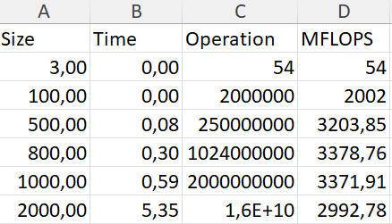
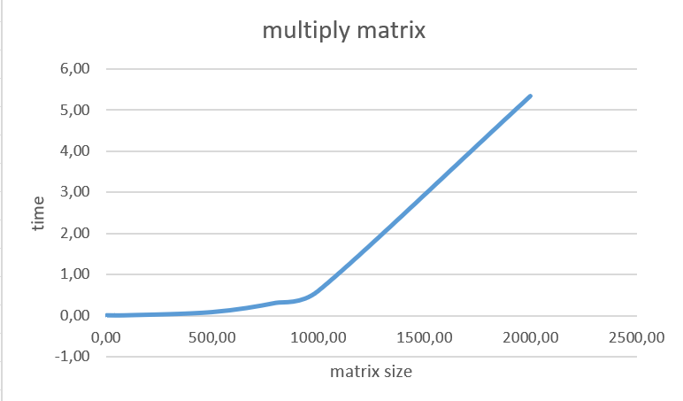
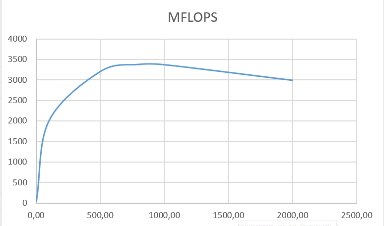
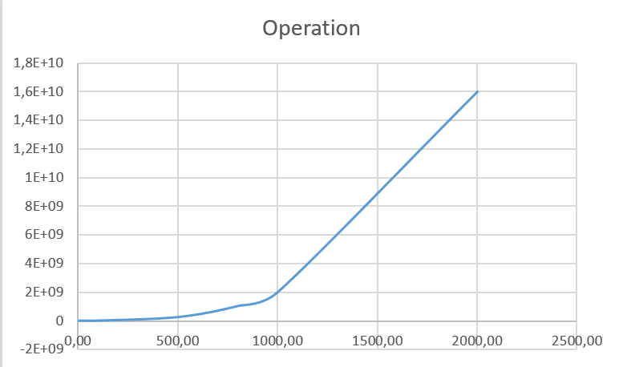

Написать программу на языке C/C++ для перемножения двух матриц. Исходные данные: файл(ы) содержащие значения исходных матриц. Выходные данные: файл со значениями результирующей матрицы, время выполнения, объем задачи. Обязательна автоматизированная верификация результатов вычислений с помощью сторонних библиотек или стороннего ПО (например на Matlab/Python).

Зависимость времени перемножения от размера матрицы:

Программа корректно реализует перемножение матриц. Результаты совпадают с расчетами в Python (верификация пройдена).Время выполнения растет пропорционально кубу размерности O(n³), что соответствует теоретической сложности алгоритма. Для матрицы 2000×2000 время составило 5.35 секунд
 Зависимость производительности (MFLOPS) от размера матрицы:

Программа корректно реализует перемножение матриц. Результаты совпадают с расчетами в Python. Производительность стабилизируется на уровне 3300-3400 MFLOPS для матриц размером от 500×500. Для малых размеров (3×3) производительность ниже из-за накладных расходов на вызов функций
Зависимость количества операций от размера матрицы:

Программа корректно реализует перемножение матриц. Результаты совпадают с расчетами в Python. Количество операций растет как 2n^3, что подтверждает правильность подсчета объема задачи. Для матрицы 2000×2000 выполняется 16 миллиардов операций

Общие выводы по работе:
Программа успешно перемножает квадратные матрицы различных размеров. Результаты полностью совпадают с верификацией в Python (NumPy). Производительность ожидаемо снижается с ростом размерности входных данных только в пересчете на относительные показатели, абсолютное время растет согласно теоретической сложности O(n^3). Все полученные данные верифицированы с помощью стороннего ПО (NumPy), что подтверждает правильность реализации.

Ссылки:
[Репозиторий на GitHub](https://github.com/prelest19/matrix-multiplication-lab)
[Исходный код](matrix_mult.cpp)
[Скрипт верификации](verify/verify.py)
